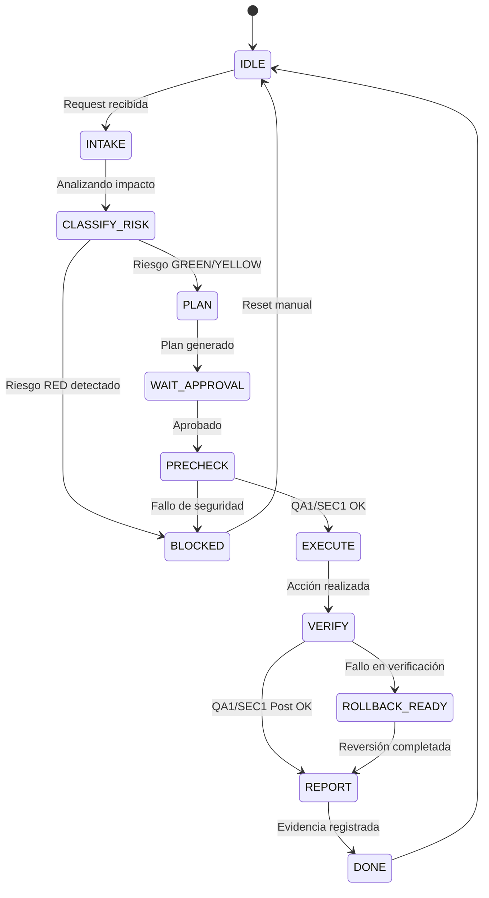

# LucyClaw Daemon v3 Architecture (R59)

## 1. Objetivo de Daemon v3
Daemon v3 está diseñado para actuar como la capa de orquestación y supervisión continua del ecosistema LucyClaw/OpenClaw.

- **Qué resuelve**: Proporciona un flujo de trabajo estructurado para la ejecución de "tramos" (tranches) operativos, asegurando que cada acción sea precedida por una validación de riesgo y seguida por una auditoría de evidencia.
- **Qué NO resuelve todavía**: No realiza reparaciones autónomas sin supervisión ni posee autonomía para modificar zonas restringidas (.env, n8n, etc.).
- **Seguridad**: No debe arrancar con reparación automática para evitar ciclos de fallo infinitos o mutaciones no deseadas en el runtime productivo.

## 2. Estado Actual (Base Operativa)
La arquitectura se construye sobre los cimientos validados en tramos anteriores:
- **Capa Verde**: Conjunto de comandos de solo lectura ya implementados.
- **QA1 / SEC1**: Compuertas de verificación de comportamiento y política de seguridad.
- **lucy_next_step**: Oráculo de decisión que bloquea el avance si el estado del sistema es inconsistente.
- **Gemini CLI / Antigravity**: Operadores validados con políticas de aislamiento.
- **Voz con Precedencia**: Sistema de TTS subordinado a las restricciones técnicas del ticket activo.

## 3. Principios de Diseño
1. **Safety First**: Ninguna acción se ejecuta si compromete la integridad del sistema o viola la política SEC1.
2. **Ticket-Bounded Execution**: Toda operación debe estar contenida dentro de un ticket con alcance definido.
3. **Evidence-First**: La evidencia de pre-chequeo y post-ejecución es obligatoria.
4. **No Shell Libre / No Sudo**: Restricción total de comandos crudos no encapsulados.
5. **Aislamiento de Secretos**: Prohibición de acceso a credenciales, n8n workflows y bóvedas por defecto.
6. **Hard Stops**: El sistema debe detenerse ante cualquier desviación del plan aprobado.

## 4. Roles del Sistema
- **Usuario (Diego)**: Autoridad máxima y definidor de objetivos.
- **ChatGPT (Supervisor)**: Validador de planes y auditor de alto nivel.
- **Antigravity (Operador)**: Agente de ejecución principal con capacidades de razonamiento.
- **Gemini CLI**: Operador alternativo para tareas automatizadas acotadas.
- **OpenClaw Gateway**: Interfaz de comunicación y ejecución de comandos.
- **Telegram**: Superficie de interacción principal.
- **Daemon v3**: Futuro orquestador que coordina los roles anteriores.

## 5. Modelo de Capas
- **Capa 0 (Roja)**: Zonas prohibidas (secretos, n8n internals, sudo).
- **Capa 1 (Verde)**: Lectura, diagnóstico y orientación.
- **Capa 2 (Azul)**: Planificación y análisis de riesgo.
- **Capa 3 (Amarilla)**: Acciones de mutación supervisadas (edición, commit, push).
- **Capa 4 (Naranja)**: Reparación planificada con rollback.
- **Capa 5 (Púrpura)**: Interacción con memoria core y n8n (restringida).

## 6. Máquina de Estados Propuesta

### Detalle de Estados:
- **INTAKE**: Captura de la solicitud y sanitización de entrada.
- **CLASSIFY_RISK**: Uso de `/risk_check` para determinar si el tramo es viable.
- **PLAN**: Creación del contrato de cambio (`/change_plan`).
- **PRECHECK**: Validación obligatoria de signos vitales antes de mutar.
- **EXECUTE**: Ejecución del tramo bajo el protocolo de operador.
- **VERIFY**: Auditoría inmediata de los resultados contra los criterios de aceptación.

## 7. Flujo de Ejecución Estándar
1. La solicitud entra vía Telegram o Supervisor.
2. `/risk_check` clasifica el riesgo.
3. `/permission_brief` calcula los permisos necesarios.
4. `/change_plan` genera el contrato técnico.
5. `/lucy_next_step` valida la compuerta de inicio.
6. **QA1 / SEC1 Pre-ejecución**.
7. Ejecución autorizada del tramo.
8. **QA1 / SEC1 Post-ejecución**.
9. Registro de evidencia y reporte final.
10. Verificación de `git status` limpio.

## 8. Modelo de Permisos
- **GREEN**: Lectura de archivos, logs y estado. No requiere autorización especial.
- **YELLOW**: Modificación de código, commits, reinicio de servicios no críticos. Requiere permiso agrupado o individual.
- **RED**: Acceso a credenciales, borrado masivo, sudo. Prohibido por defecto.

## 9. Evidence Envelope (Sobre de Evidencia)
Formato de reporte obligatorio para cada ejecución:
- `tranche_id`: Identificador único del tramo.
- `base_commit`: SHA inicial.
- `operator`: Agente que ejecutó (Antigravity/GeminiCLI).
- `commands_run`: Lista de comandos ejecutados.
- `files_changed`: Lista de archivos modificados.
- `tests_pre / tests_post`: Resultados de QA1/SEC1.
- `risk`: Nivel de riesgo final operado.
- `approval_mode`: Cómo se obtuvo el permiso.
- `next_recommendation`: Paso sugerido tras el éxito o fallo.

## 10. Relación con QA1 / SEC1 / lucy_next_step
- **QA1**: Valida que el comportamiento sea el esperado (funcional).
- **SEC1**: Valida que la ejecución no haya violado la política de seguridad (seguridad).
- **lucy_next_step**: Funciona como el semáforo del Daemon; si está en `BLOCK`, el Daemon no debe iniciar ningún tramo amarillo.

## 11. Rollback Conceptual
- **Documentación**: Reversión de cambios en archivos MD vía Git.
- **Plugins/Runtime**: Desactivación de plugins inestables y vuelta a configuración anterior.
- **No automatizar todavía**: No realizar rollbacks automáticos en n8n o bases de datos sin supervisión humana.

## 12. Manejo de Voz
El sistema de voz está subordinado al contexto operativo:
- Permitida si el ticket no la prohíbe.
- **Suspendida** si el ticket detecta riesgo de mutación en `n8n_data` o si se prohíbe explícitamente el TTS.

## 13. No-Goals de v3
- No reparación autónoma inmediata sin intervención.
- No alteración de flujos de n8n productivos.
- No gestión de secretos ni escalada de privilegios (sudo).

## 14. Roadmap Sugerido
1. **R60**: Protocolo formal de acciones amarillas.
2. **R61**: Implementación del *Evidence Envelope* y registro de corridas.
3. **R62**: Runbook documental para rollbacks manuales guiados.
4. **R63**: Primer ejecutor amarillo mínimo (Commit/Push automatizado).

## 15. Riesgos Abiertos
- Drift entre la documentación (SSOT) y el estado real del sistema.
- Dependencia de la disponibilidad del Gateway para reportes.
- Riesgo de falsos positivos en QA1 si los tests no son exhaustivos.

## 16. Decisión Final
Daemon v3 debe nacer como un **Supervisor de Evidencia**, priorizando el registro de qué se hizo y por qué, antes de intentar ser un agente de reparación autónoma.
